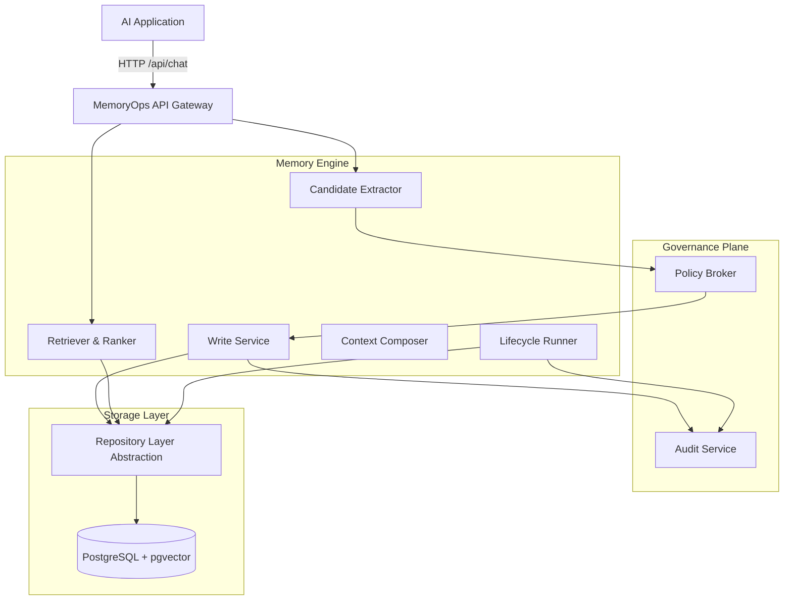
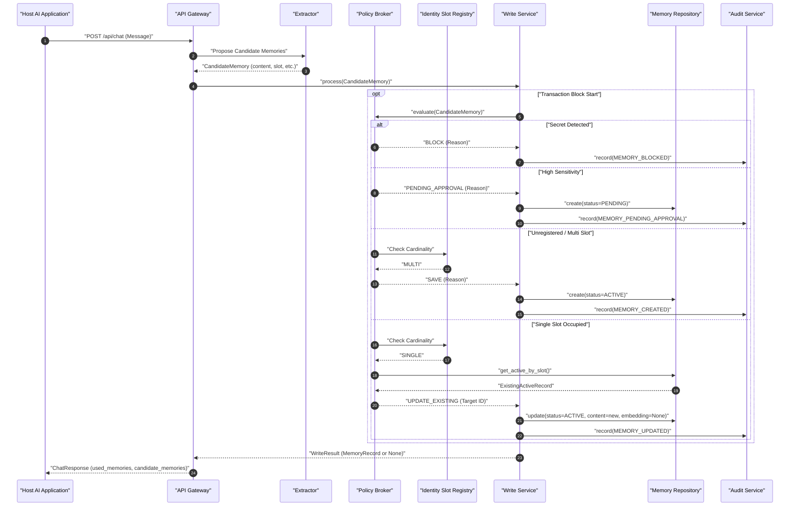
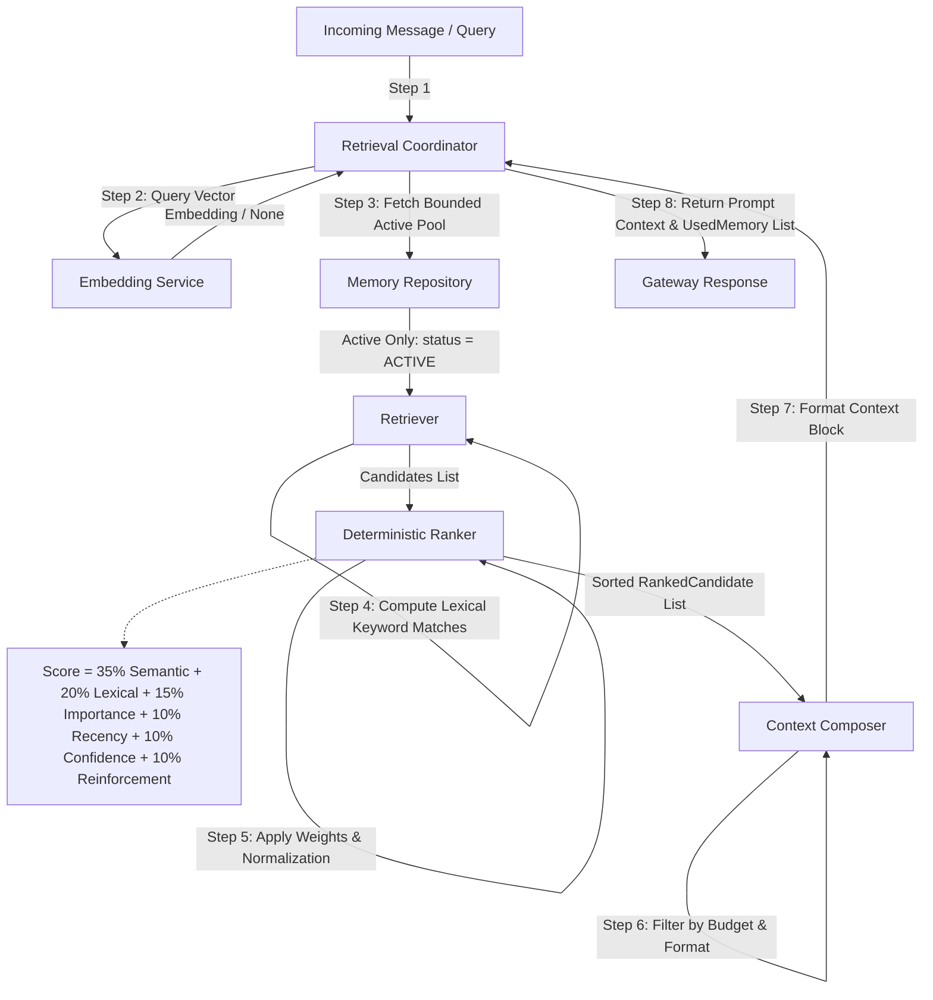
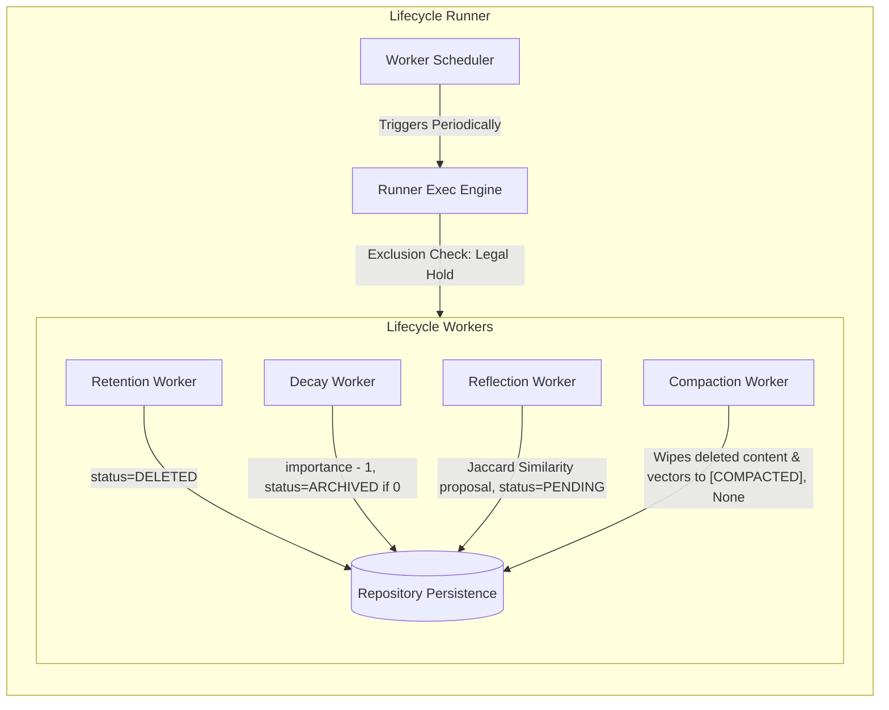
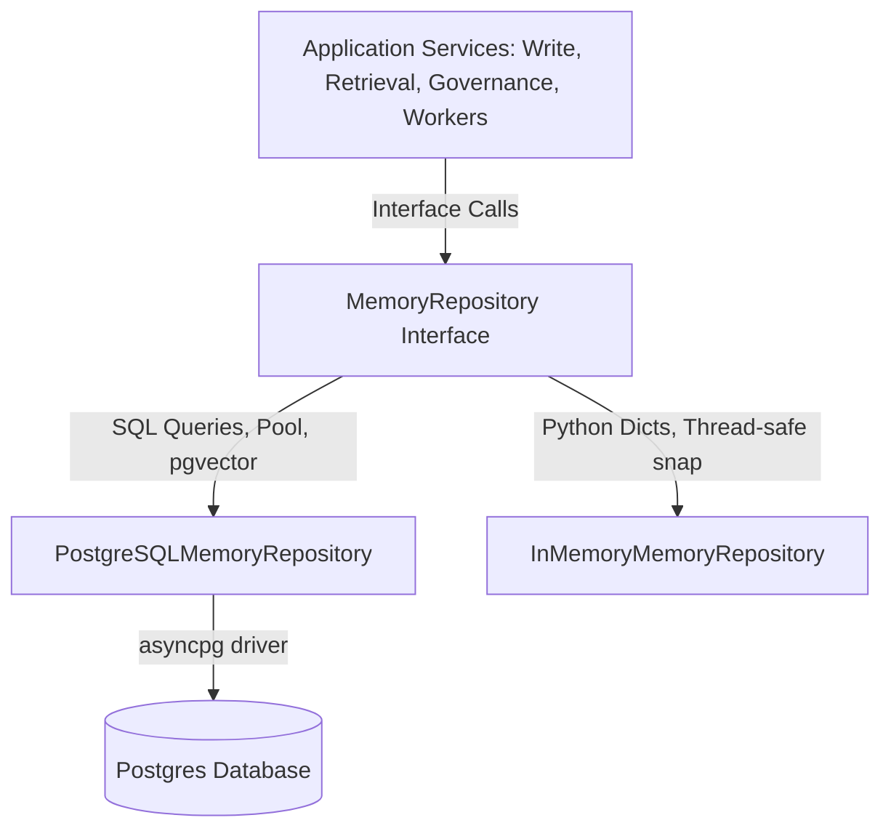
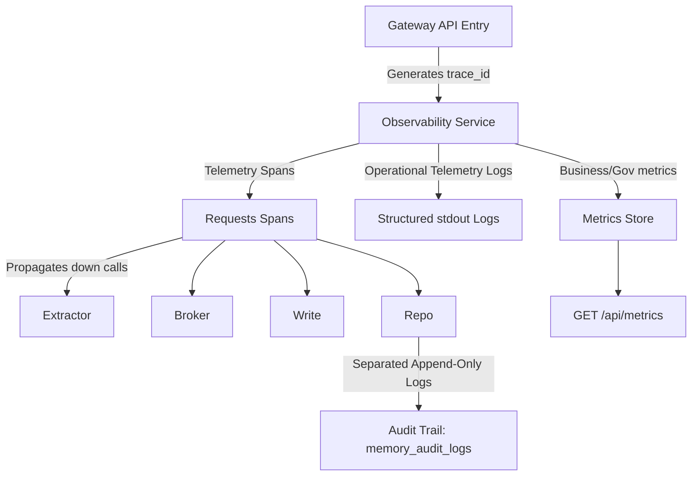
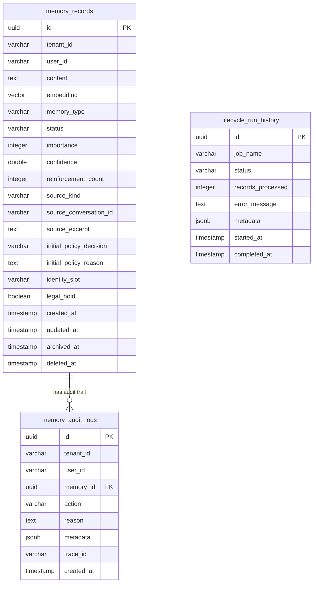

# MemoryOps AI

[]()
[]()
[]()
[]()
[]()

MemoryOps AI is a production-grade, governed long-term memory operating system for Large Language Model (LLM) applications. Unlike simple vector databases or caching wrappers, MemoryOps AI treats memory as a governed persistent system state subject to safety policies, transaction integrity, structured lifecycles, and explainable retrieval.

* **Current Status:** Production-Ready & Fully Tested
* **Current Version:** `1.0.0`
* **License:** MIT

---

## Table of Contents

- [Overview](#overview)
- [Why MemoryOps AI Exists](#why-memoryops-ai-exists)
- [Key Features](#key-features)
- [Architecture Overview](#architecture-overview)
  - [High-Level Architecture](#high-level-architecture)
  - [Write Path Flow](#write-path-flow)
  - [Retrieval Path Flow](#retrieval-path-flow)
  - [Transaction Flow](#transaction-flow)
  - [Lifecycle Workers](#lifecycle-workers)
  - [Repository Layer Abstraction](#repository-layer-abstraction)
  - [Observability & Telemetry Flow](#observability--telemetry-flow)
  - [Database Schema & Layout](#database-schema--layout)
- [Engineering Principles](#engineering-principles)
- [Core Components](#core-components)
- [Memory Lifecycle](#memory-lifecycle)
- [Retrieval Pipeline](#retrieval-pipeline)
- [Governance](#governance)
- [Database Design](#database-design)
- [Transactions](#transactions)
- [Observability](#observability)
- [Performance & Benchmarks](#performance--benchmarks)
- [Security](#security)
- [Deployment](#deployment)
- [Project Structure](#project-structure)
- [Getting Started](#getting-started)
- [Configuration Reference](#configuration-reference)
- [Testing](#testing)
- [Operations & Runbooks](#operations--runbooks)
- [Design Decisions (ADRs)](#design-decisions-adrs)
- [Roadmap](#roadmap)
- [Contributing](#contributing)
- [Frequently Asked Questions](#frequently-asked-questions)
- [Acknowledgements](#acknowledgements)
- [License](#license)

---

## Overview

### What is MemoryOps AI?
MemoryOps AI is an operational control plane for LLM memory management. In modern agentic applications, memory represents user instructions, persistent facts, temporal interaction history, and procedural guidelines. If left ungoverned, memory degrades quickly—leading to hallucinations, privacy leaks, coordinate drift, and unbounded context window consumption. 

MemoryOps AI wraps memory read, write, and background lifecycle operations in a rigorous, policy-driven runtime. It guarantees that candidate memories are filtered for secrets before they are stored, evaluates identity slot collisions before updates, handles transactional rollbacks on database failures, and ranks memories using an inspectable, multi-signal ranking formula.

### Why Naïve Vector Databases are Insufficient
Naive retrieval setups query a vector index solely using cosine similarity over embeddings:
```text
User Input ──> Generate Embedding ──> Cosine Similarity ──> Top-K Context Injection
```
This approach suffers from fundamental operational flaws in enterprise applications:
1. **Unbounded Duplication:** Similar interactions lead to duplicate memories representing the same semantic entity, inflating prompt costs.
2. **Missing Lexical Parity:** Vector models are notoriously poor at matching exact UUIDs, serial numbers, email addresses, or punctuation-stripped codes.
3. **No Forgetting Guarantee:** Soft-deletions must execute cleanly across retrieval paths. Simple metadata filters are error-prone and bypassable.
4. **No Governance Gating:** LLM extraction is probabilistic. If an extractor generates memory containing API keys or PII, a raw vector database accepts it silently.

### Why Governance Matters
In a production-grade AI system, memory is system state. Governed memory ensures that:
- Every mutation produces append-only audit evidence.
- High-sensitivity data is held in a validation queue for human approval.
- Developers can trace exactly which memories entered an LLM context and inspect the exact weights that contributed to their selection.
- Legal holds can freeze memory deletions during audits.

---

## Why MemoryOps AI Exists

A production memory system must resolve structural memory anomalies:

*   **Hallucinated Memory:** The model extracts a fact that did not happen. Governed validation prevents storing candidate records without confidence thresholds.
*   **Duplicate Memories:** The user states `"I use Python"` across multiple turns. Instead of storing five different records, the Policy Broker routes candidate updates to an existing coordinate.
*   **Stale Memories:** A user moves from Boston to Seattle. The system must decay the importance of the old fact and archive or update it, preventing conflicting geographical context.
*   **Forgotten Context:** Time-sensitive preferences decay. Background workers compute recency curves and archive records whose importance drops to zero.
*   **Unsafe Memory Persistence:** API credentials, private passwords, or security secrets are extracted. The Policy Broker executes high-precedence regex filters to block writes and records the violation in the audit trail.

---

## Key Features

- **Governed Write Path:** Intercepts proposed candidates using the Policy Broker. Implements deterministic blocking rules for API keys, passwords, and custom sensitivity gates.
- **Hybrid Retrieval Spine:** Blends semantic search (`pgvector`) and Python-based lexical term matching, enforcing tenant boundaries and active-status invariants before ranking.
- **Deterministic Ranker:** Uses a multi-factor score (35% Semantic, 20% Lexical, 15% Importance, 10% Recency, 10% Confidence, 10% Reinforcement) with strict tie-breaking (`created_at` DESC then `id` ASC) to guarantee stable, inspectable context composition.
- **Transactional Dual-Parity:** Employs a contextvars-backed transaction manager. Supports genuine database savepoints in PostgreSQL and snapshots/restores for in-process memory backends.
- **Memory Lifecycle Engine:** Runs asynchronous background jobs (`RetentionWorker`, `DecayWorker`, `ReflectionWorker`, and `CompactionWorker`) with concurrent lock protection.
- **Identity Slot Gating:** Maps memory coordinates to registry coordinates. Enforces slot constraints such as `SINGLE` occupant (which triggers automated updates) and `MULTI` occupant (which permits additive records).
- **Append-Only Auditing:** Records all mutations to a distinct, immutable table (`memory_audit_logs`). No API capabilities exist to delete or modify audit trails.
- **Failure-Safe Telemetry:** Tracks spans, execution latency, and metrics using structured logs and asynchronous monitoring without interrupting host application loops.

---

## Architecture Overview

### High-Level Architecture



### Write Path Flow



### Retrieval Path Flow



### Transaction Flow

```mermaid
graph TD
    subgraph postgres ["PostgreSQL Backend"]
        RootTx["Root Transaction: acquires conn from db_manager.pool"]
        RootTx -->|"ContextVar db_tx_conn set"| Exec1["Execute Queries"]
        Exec1 -->|"Nested call"| NestTx["Nested Transaction"]
        NestTx -->|"SQL SAVEPOINT"| Exec2["Execute Nested Queries"]
        Exec2 -->|"Exception raised"| RollbackSave["Rollback to SAVEPOINT"]
        Exec1 -->|"Successful completion"| CommitRoot["Commit Root Transaction"]
    end

    subgraph memory ["Simulated In-Memory Backend"]
        Snapshot["Capture snapshot of MemoryRepository._records and AuditService._events"]
        Snapshot -->|"Push to Stack contextvar"| ExecInMemory["Execute updates/creates"]
        ExecInMemory -->|"Successful execution"| PopStack["Discard snapshot from Stack"]
        ExecInMemory -->|"Exception raised"| RollbackInMemory["Pop and restore records & events dictionaries"]
    end
```



### Lifecycle Workers



### Repository Layer Abstraction



### Observability & Telemetry Flow



### Database Schema & Layout



---

## Engineering Principles

1.  **Repository Pattern:** Separates persistence schema from domain business rules. Services invoke method contracts on `MemoryRepository`, ensuring the system remains database-agnostic.
2.  **Dependency Inversion:** High-level policy and write services depend on abstractions rather than concrete instances, allowing simple substitutions (e.g. testing with `InMemoryMemoryRepository`).
3.  **Deterministic Policies:** LLMs generate recommendations, but final safety (regex scanning, coordinate verification, slot boundaries) is strictly deterministic and hard-coded.
4.  **Governance First:** Auditing, scope boundaries, and deletion invariants are evaluated at the root. No write path bypasses policy review, and no read path query bypasses status filters.
5.  **Observability First:** Telemetry logs do not write to the transaction database. Operations logging and audit logs are separated.
6.  **Testability:** In-memory mocks simulate database rollbacks, allowing tests to run in parallel in milliseconds without Docker dependencies, while assuring total behavioral parity.
7.  **Fail-Safe Design:** If embedding services or vector databases fail, the retrieval pipeline degrades to lexical query matching without failing host application turns.

---

## Core Components

*   **Gateway (`app.main`):** Exposes HTTP endpoint surface (FastAPI), sets request lifetimes, handles exception mapping, and manages connection pools.
*   **Write Service (`app.services.write`):** Coordinates candidate checks. Translates Policy Broker decisions into repository calls and emits corresponding audit events inside a single transaction.
*   **Policy Broker (`app.policy.broker`):** Implements automated rules for credential matching, high-sensitivity queuing, and card-based slot routing.
*   **Retrieval Coordinator (`app.services.retrieval`):** Handles retrieval requests. Queries embedding providers, retrieves active candidates, executes keyword math, sorts records, and limits prompt output size.
*   **Embedding Service (`app.services.embedding`):** Provides model-agnostic text vectorization. Features concrete integrations for OpenAI, Google Gemini, and a Lexical Fallback driver.
*   **Memory Repository (`app.repositories.postgres` & `app.repositories.memory`):** Enforces scope boundaries (`tenant_id`, `user_id`) and active filter requirements on physical queries.
*   **Lifecycle Runner (`app.services.lifecycle`):** Manages worker registration, schedules execution iterations, enforces concurrency isolation per task coordinate, and records history logs.
*   **Audit Service (`app.services.audit`):** Provides append-only, tamper-resistant governance timeline logging.
*   **Transaction Manager (`app.repositories.transactions`):** Coordinates logical transaction scope blocks. Maps to Postgres pool transactions or local in-process stack rollbacks.
*   **Observability Service (`app.services.observability`):** Provides log formatting, metrics aggregation, and span creation.

---

## Memory Lifecycle

Memory transitions through distinct states managed by the Policy Broker and Lifecycle workers:

| State | Admitted By | Retrievable? | Terminal? | Notes |
| :--- | :--- | :--- | :--- | :--- |
| `pending` | Broker `PENDING_APPROVAL` | No | No | Awaiting administrative approval. |
| `active` | Broker `SAVE` or Admin Approve | Yes | No | Eligible for prompt context injection. |
| `rejected` | Admin Reject | No | Yes | Denied candidate. |
| `archived` | Decay Worker or Admin Archive | No | No | Replaced or stale context, kept for auditing. |
| `deleted` | User Delete or Retention Worker | No | Yes | Logically forgotten. Compacted subsequently. |

```text
       Candidate Memory
              │
              ▼
        Policy Broker
              │
      ┌───────┼──────────────┬──────────────┐
      │       │              │              │
    SAVE    PENDING        BLOCK          DROP
      │       │              │              │
    active  pending     audit only     audit only
      │       │
      │   ┌───┴───┐
      │   ▼       ▼
      │ approve reject
      │   │       │
      └──>│    rejected
          │
      ┌───┴───────────────────┐
      ▼                       ▼
   decayed                 deleted
  (archived)             (forgotten)
                              │
                              ▼
                         compacted
```

### Lifecycle Actions
- **Admission:** Extractor proposes `CandidateMemory`. Broker evaluates and determines initial state.
- **Storage:** Persisted to DB with current timestamps.
- **Retrieval:** Fetches `ACTIVE` memory only.
- **Decay:** `DecayWorker` runs. Decrements importance of inactive memories. If importance falls to `0`, updates status to `archived`.
- **Retention:** `RetentionWorker` scans records with `expires_at`. Transitions expired entries to `deleted`.
- **Reflection:** `ReflectionWorker` computes Jaccard overlaps. Generates merge proposals to consolidate duplicate memories.
- **Compaction:** `CompactionWorker` scrubs `content` value to `"[COMPACTED]"` and purges `embedding` vector coordinates for `deleted` status rows.
- **Deletion:** Logical deletion transitions status to `deleted` and sets `deleted_at`.
- **Audit:** Append-only logging of transitions.

---

## Retrieval Pipeline

The retrieval read-path executes as a single-candidate-pool pipeline:

```text
Incoming Query ──> Embed ──> Candidate Query ──> Python Lexical Match ──> Multi-Factor Score ──> Budget Filtering ──> Context Composition
```

### 1. Lexical Matching
Calculates keyword term match statistics in Python memory over retrieved records:
- **Query & Content Normalization:** Unicode NFKC normalization, lowercase case folding, replacing non-alphanumeric symbols with spaces, and splitting by whitespace. No stopword filtering or stemming is performed.
- **Lexical Score Formula:**
```math
\text{keyword_score} = \frac{\text{matched_query_terms}}{\max(\text{total_unique_query_terms}, 1)}
```

### 2. Multi-Signal Ranking
Evaluates normalized scores `[0.0, 1.0]` across six dimensions:
- `semantic_score = clamp(cosine_similarity, 0.0, 1.0)`
- `keyword_score = matches / total`
- `importance_score = importance / 10`
- `confidence_score = clamp(confidence, 0.0, 1.0)`
- `recency_score = exp(-age_days / 30)` (Decay from `updated_at` to request time)
- `reinforcement_score = 1 - exp(-reinforcement_count / 5)`
```math
\text{Score} = 0.35 \times \text{semantic} + 0.20 \times \text{lexical} + 0.15 \times \text{importance} + 0.10 \times \text{recency} + 0.10 \times \text{confidence} + 0.10 \times \text{reinforcement}
```

### 3. Tie-Breaking
If candidates share the identical final score, the ranker breaks ties using:
1. `created_at` DESC (Prefers newer records)
2. `id` ASC (Lexicographical sort of UUID to ensure stable order)

### 4. Context Budget & Oversized Skipping
Limits prompt injection size using a dual-bound budget:
- `max_memories = 10`
- `max_characters = 4000`

If adding the next ranked memory exceeds the remaining character limit, that candidate is **skipped** without truncation, and the selector continues down the list to check if smaller records fit the budget.

---

## Governance

MemoryOps AI enforces security-sensitive policies at runtime:

### Automated Policy Evaluation
Every candidate memory is evaluated by the Policy Broker:
1. **Secret Pattern Scanning:** Regular expressions scan for API credentials (e.g. `sk-xxxx`) and assignment parameters (`password = "..."`). Violations trigger an immediate `BLOCK` decision.
2. **Sensitivity Routing:** Candidates with `sensitivity = HIGH` are routed to `PENDING_APPROVAL` and require manual operator validation.
3. **Identity Slot Mapping:** Coordinates map to the registry. Single-valued slots (e.g., `user_job_title`) check for active occupants; if occupied, they route to `UPDATE_EXISTING` instead of adding duplicates.

### Sensitivity, Importance, and Confidence
- **Sensitivity:** `low`, `medium`, `high`. Used for safety routing.
- **Importance:** `0` (trivial) to `10` (permanent fact). Establishes retention thresholds.
- **Confidence:** `0.0` to `1.0`. Measures extraction reliability.

### Legal Hold
Any memory record with `legal_hold = true` is frozen. Attempts to delete, decay, compact, or mutate the record raise a validation error, preventing state changes.

### Audit Trail
Every lifecycle state transition generates append-only evidence containing `tenant_id`, `user_id`, `action`, `reason`, `trace_id`, and `created_at`. No update or delete endpoints exist for the audit log table.

---

## Database Design

PostgreSQL with `pgvector` pre-installed is the canonical system of record.

### Table Structures

#### 1. `memory_records`
Persistent store for user memories:
```sql
CREATE TABLE memory_records (
    id UUID PRIMARY KEY,
    tenant_id VARCHAR(255) NOT NULL,
    user_id VARCHAR(255) NOT NULL,
    content TEXT NOT NULL,
    embedding VECTOR(1536), -- Normalized float dimensions
    memory_type VARCHAR(50) NOT NULL,
    status VARCHAR(50) NOT NULL,
    importance INT NOT NULL CHECK (importance >= 0 AND importance <= 10),
    confidence DOUBLE PRECISION NOT NULL CHECK (confidence >= 0.0 AND confidence <= 1.0),
    reinforcement_count INT NOT NULL DEFAULT 0,
    source_kind VARCHAR(50) NOT NULL,
    source_conversation_id VARCHAR(255),
    source_excerpt TEXT,
    initial_policy_decision VARCHAR(50),
    initial_policy_reason TEXT,
    identity_slot VARCHAR(255),
    legal_hold BOOLEAN NOT NULL DEFAULT FALSE,
    created_at TIMESTAMP WITH TIME ZONE NOT NULL DEFAULT NOW(),
    updated_at TIMESTAMP WITH TIME ZONE NOT NULL DEFAULT NOW(),
    archived_at TIMESTAMP WITH TIME ZONE,
    deleted_at TIMESTAMP WITH TIME ZONE
);
```

#### 2. `memory_audit_logs`
Immutable logging trail:
```sql
CREATE TABLE memory_audit_logs (
    id UUID PRIMARY KEY,
    tenant_id VARCHAR(255) NOT NULL,
    user_id VARCHAR(255) NOT NULL,
    memory_id UUID REFERENCES memory_records(id) ON DELETE SET NULL,
    action VARCHAR(50) NOT NULL,
    reason TEXT,
    metadata JSONB,
    trace_id VARCHAR(255),
    created_at TIMESTAMP WITH TIME ZONE NOT NULL DEFAULT NOW()
);
```

#### 3. `lifecycle_run_history`
Background job tracking:
```sql
CREATE TABLE lifecycle_run_history (
    id UUID PRIMARY KEY,
    job_name VARCHAR(255) NOT NULL,
    status VARCHAR(50) NOT NULL,
    records_processed INT NOT NULL DEFAULT 0,
    error_message TEXT,
    metadata JSONB,
    started_at TIMESTAMP WITH TIME ZONE NOT NULL,
    completed_at TIMESTAMP WITH TIME ZONE
);
```

### Index Strategy
To optimize multi-tenant lookups and vector searches, the database implements:
- **Tenant Scope Index:** Composite index on `(tenant_id, user_id, status)` for fast active query filtering.
- **pgvector Index:** Cosine distance index for semantic retrieval:
  ```sql
  CREATE INDEX ON memory_records USING hnsw (embedding vector_cosine_ops);
  ```
- **Slot Index:** B-Tree index on `(tenant_id, user_id, memory_type, identity_slot)` to prevent duplicate active slot occupancies.

---

## Transactions

MemoryOps AI provides a unified transaction manager that enforces transactional guarantees across both persistent SQL and simulated memory backends.

### PostgreSQL Backend
- **ContextVars Management:** The active transaction connection is stored inside `db_tx_conn: ContextVar`.
- **Root Transaction:** Spawns a database transaction block on the connection:
  ```python
  async with connection.transaction():
      yield
  ```
- **Nested Transactions:** If a transaction is already active, subsequent entries invoke nested transaction contexts, which translate to database `SAVEPOINT` calls under the hood, allowing partial rollbacks.

### In-Memory Parity
For local testing and sqlite-like execution speeds without PostgreSQL:
- Uses a snapshot stack (`in_memory_tx_snapshots: ContextVar`).
- Upon starting a transaction block, captures a deep copy of the repository's internal dictionaries (`_records` and `_events`).
- If an exception occurs, pops the snapshot off the stack and restores the repository state, simulating a rollback.

---

## Observability

Observability in MemoryOps AI separates business auditing from process-level telemetry.

### Metrics Collection
Aggregates performance counters at the gateway level:
- **`retrieval_latency_ms`:** Latency of the read pipeline.
- **`write_latency_ms`:** Transaction processing duration.
- **`lifecycle_worker_duration`:** Background execution run times.

### Spans & Tracing
A `trace_id` is generated at the gateway for each request. The trace propagates downstream:
```text
Gateway ──(trace_id)──> Extractor ──(trace_id)──> Policy Broker ──(trace_id)──> Write Service ──(trace_id)──> Repository
```
Traces are embedded in structured operational logs to allow easy tracing across services.

### Fail-Silent Telemetry
Telemetry services catch internal tracing or metrics submission exceptions. If a logging server goes offline, the tracking components fail silently without interrupting the host application loop.

---

## Performance & Benchmarks

Performance testing contrasted in-memory execution against PostgreSQL persistence:

### Load & Stress Benchmarks
- **Environment:** Windows Host, pgvector Docker instance (Port 5433), connection pool `min=2, max=10`.
- **Seeded Pool:** 500 memory records per run.

| Metrics Area | In-Memory (10 Workers) | In-Memory (40 Workers) | Postgres (10 Workers) | Postgres (40 Workers) |
| :--- | :--- | :--- | :--- | :--- |
| **Duration (Total)** | 0.032 s | 0.151 s | 1.012 s | 3.843 s |
| **Throughput (req/sec)** | 3129.34 | 2641.58 | 98.84 | 104.10 |
| **Read Latency (p95)** | 0.52 ms | 0.68 ms | 353.48 ms | 942.13 ms |
| **Write Latency (p95)** | 0.56 ms | 0.72 ms | 421.62 ms | 1285.12 ms |

### Latency Profiles (p95)
- **Context Retrieval:** `0.33 ms` (Memory) vs. `20.04 ms` (Postgres)
- **Write Transaction:** `0.56 ms` (Memory) vs. `421.62 ms` (Postgres)

### Known Bottlenecks
1.  **Subprocess Connections:** Connection pools are bypassed by auxiliary testing scripts (`postgres.py`), opening raw socket calls. Production environments must bind all connections to the connection pool.
2.  **SQL Transaction Round-Trips:** Single write latency averages `127.83 ms` in Postgres due to write-ahead log flushes. Applications requiring massive ingestion rates should utilize batch writing or asynchronous flushes.

---

## Security

1.  **TLS/SSL Enforcement:** Production settings enforce `verify-ca` or `verify-full` connection profiles. Connection attempts with `disable` or `prefer` raise validation errors on startup.
2.  **Environment Fail-Fast:** `Settings` validates parameters using Pydantic. If default secrets (e.g. `POSTGRES_USER=postgres`) or mismatched ranges are detected in production, the application terminates immediately on import.
3.  **Secret Scrubbing:** Regex checks reject candidate memory contents containing API keys or credential strings before they are saved to database rows.
4.  **Connection Pool Tuning:** Restricts maximum open connections (`max_pool_size=10`) and defines a maximum wait time (`connection_timeout=10.0s`) to prevent pool starvation attacks.

---

## Deployment

MemoryOps AI is packaged for Docker and Docker Compose deployment.

### Production Environment Variables
Set these variables in your production environment:

```env
ENVIRONMENT=production
DATABASE_TYPE=postgres
POSTGRES_HOST=prod-db.internal
POSTGRES_PORT=5432
POSTGRES_DB=memoryops_prod
POSTGRES_USER=app_user
POSTGRES_PASSWORD=prod_secure_password_string
POSTGRES_SSL=verify-full
POSTGRES_MIN_POOL_SIZE=10
POSTGRES_MAX_POOL_SIZE=50
OPENAI_API_KEY=sk-proj-...
```

### Docker compose Setup
Launch the database container:
```bash
docker compose up -d
```

### Dockerfile Build & Execution
Build the production container:
```bash
docker build -t memoryops-api:latest .
```

Run the application:
```bash
docker run -p 8000:8000 --env-file .env memoryops-api:latest
```

---

## Project Structure

```text
memoryops-ai/
├── Dockerfile                   # Production multi-stage Docker build
├── docker-compose.yml           # Local database container configuration
├── requirements.txt             # Python application dependencies
├── LICENSE                      # MIT license file
├── AGENTS.md                    # Engineering contract and rules
├── ROADMAP.md                   # Phased evolution milestone registry
├── services/
│   └── api/                     # MemoryOps API service root
│       └── app/
│           ├── main.py          # FastAPI application entry point
│           ├── config.py        # Settings validation (Pydantic-settings)
│           ├── runtime.py       # Global service registration and wiring
│           ├── domain/          # Pydantic schema schemas and models
│           │   ├── models.py    # Record models (MemoryRecord, AuditEvent)
│           │   ├── enums.py     # Constants (MemoryStatus, MemoryType)
│           │   └── retrieval.py # Context selection schemas
│           ├── policy/          # Admission policy logic
│           │   ├── broker.py    # Automated policy evaluating and regex
│           │   └── registry.py  # Slot coordinate metadata registry
│           ├── repositories/    # Database repository implementations
│           │   ├── base.py      # Abstract repository definitions
│           │   ├── memory.py    # Local thread-safe mock repository
│           │   ├── postgres.py  # asyncpg & pgvector repository
│           │   ├── postgres_connection.py # Connection pool manager
│           │   └── transactions.py        # contextvars transaction runner
│           ├── routes/          # FastAPI API endpoint routers
│           │   ├── chat.py      # RAG pipeline (/chat) endpoint
│           │   └── governance.py# Governance actions (/memories, /audit)
│           └── services/        # Domain processing routines
│               ├── write.py     # Admission coordinator
│               ├── retrieval.py # Search, keyword count, Ranker, Composer
│               ├── governance.py# Metadata patch and deletion controls
│               ├── lifecycle.py # Scheduler, workers (Retention, Decay)
│               ├── audit.py     # Append-only audit logger
│               └── embedding.py # OpenAI / Gemini vectorizers
└── tests/                       # Complete test suite
    ├── run_benchmarks.py        # Stress test runner
    ├── test_postgres_repository.py # Database integration test
    └── test_retrieval_services.py  # Retrieval matching verification
```

---

## Getting Started

### 1. Prerequisites
- Python 3.11+
- Docker & Docker Compose (if running with PostgreSQL)

### 2. Installation
Clone the repository and install dependencies:
```bash
git clone https://github.com/jacobjerryarackal/memoryops-ai.git
cd memoryops-ai
python -m venv .venv
source .venv/bin/activate  # On Windows: .venv\Scripts\activate
pip install -r requirements.txt
```

### 3. Environment Setup
Copy the example environment configuration:
```bash
cp .env.example .env
```
Fill in credentials (e.g. `OPENAI_API_KEY`) and set `DATABASE_TYPE=memory` for local development.

### 4. Running Locally (FastAPI)
Run the application server using Uvicorn:
```bash
uvicorn services.api.app.main:app --host 127.0.0.1 --port 8000 --reload
```
Navigate to `http://localhost:8000/docs` to view interactive API documentation.

### 5. Running Tests
Run the test suite using pytest:
```bash
pytest
```

---

## Configuration Reference

The following environment variables configure the MemoryOps AI runtime:

| Variable Name | Type | Default Value | Description / Security Constraints |
| :--- | :--- | :--- | :--- |
| `ENVIRONMENT` | String | `development` | Environment mode (`development`, `production`). Enforces SSL and secrets checks if `production`. |
| `DATABASE_TYPE` | String | `memory` | Active backend. Must be `memory` (local) or `postgres` (persistent). |
| `PORT` | Integer | `8000` | Port for the FastAPI server to bind to. |
| `HOST` | String | `127.0.0.1` | Network interface for FastAPI to bind to. |
| `POSTGRES_HOST` | String | `127.0.0.1` | Hostname of the Postgres database. |
| `POSTGRES_PORT` | Integer | `5432` | Port of the Postgres database (Range 1-65535). |
| `POSTGRES_DB` | String | `postgres` | Database name. |
| `POSTGRES_USER` | String | `postgres` | Username. Defaults are blocked in production mode. |
| `POSTGRES_PASSWORD` | String | `postgres` | Password. Defaults are blocked in production mode. |
| `POSTGRES_SSL` | String | `prefer` | SSL mode (`disable`, `prefer`, `require`, `verify-ca`, `verify-full`). |
| `POSTGRES_MIN_POOL_SIZE` | Integer | `2` | Minimum active connections maintained in connection pool. |
| `POSTGRES_MAX_POOL_SIZE` | Integer | `10` | Maximum active connections allowed in connection pool. |
| `POSTGRES_CONNECTION_TIMEOUT` | Float | `10.0` | Connection acquisition timeout in seconds. |
| `EMBEDDING_PROVIDER` | String | `openai` | Embedding provider (`openai`, `gemini`, `fallback`). |
| `OPENAI_API_KEY` | String | `None` | API key for OpenAI embeddings (Required if provider is `openai`). |
| `GEMINI_API_KEY` | String | `None` | API key for Google Gemini embeddings (Required if provider is `gemini`). |

---

## Testing

MemoryOps AI maintains a comprehensive test suite across several execution profiles:

### Unit Tests
Verify model schemas, serialization, policy evaluations, and Jaccard calculations in isolation.
Run unit tests:
```bash
pytest tests/test_domain_models.py tests/test_policy.py
```

### Integration Tests
Verify repository behaviors, transaction rollback scenarios, and connection pool properties using both in-process dictionaries and Postgres databases.
Run repository integration tests:
```bash
pytest tests/test_repository.py tests/test_postgres_repository.py
```

### Regression Tests
Run the test suite under both environment backend profiles to ensure dual-parity correctness:
```bash
# In-Memory Database Regression
DATABASE_TYPE=memory pytest

# PostgreSQL Database Regression
DATABASE_TYPE=postgres pytest
```

### Failure Injection & Resilience
Tests simulate outages (database offline, connection pools depleted, background workers throwing errors) to ensure:
- State modifications roll back properly during transaction exceptions.
- Lifecycles reschedule gracefully after worker failures.

---

## Operations & Runbooks

### Operational Runbooks

#### 1. Connection Pool Starvation (`runbook-connection-pool-starvation.md`)
*   **Symptom:** API endpoints return `503 Service Unavailable` with `STORAGE_UNAVAILABLE` error codes. Latencies spike.
*   **Diagnostics:** Inspect active connections in pg_stat_activity:
    ```sql
    SELECT count(*), state FROM pg_stat_activity GROUP BY state;
    ```
*   **Resolution:** Verify all repository helper commands execute inside transaction blocks. If nested calls use dynamic connections outside `db_tx_conn`, they must be closed. Increase `POSTGRES_MAX_POOL_SIZE` if necessary.

#### 2. Failed Migrations Recovery (`runbook-failed-migration-recovery.md`)
*   **Symptom:** Startup fails with SQL syntax errors or missing schema properties.
*   **Diagnostics:** Check the `migrations_applied` table:
    ```sql
    SELECT * FROM migrations_applied;
    ```
*   **Resolution:** If a migration failed partially, manually roll back the incomplete schema modification and execute the migration script again:
    ```bash
    python infra/db/run_migrations.py
    ```

#### 3. Database Recovery (`runbook-database-recovery.md`)
*   **Symptom:** Persistent DB corruption or hardware failure.
*   **Backup:** Generate a database dump:
    ```bash
    python infra/db/backup.py
    ```
*   **Restore:** Restore the database schema and content from a dump:
    ```bash
    python infra/db/restore.py
    ```

---

## Design Decisions (ADRs)

Architecture Decision Records (ADRs) are located in `infra/adr/`:

- **ADR-001: Storage Selection**  
  Selects PostgreSQL with `pgvector` as the system of record. Rejects independent vector databases to preserve transactional integrity and prevent coordinate drift. Establishes the repository abstraction to support local mock testing.
- **ADR-002: Hybrid Retrieval and Deterministic Ranking**  
  Implements a single candidate pool combining semantic similarity and lexical keyword match metrics. Ranking is strictly deterministic to provide auditable relevance scores.
- **ADR-003: Policy Broker before Storage**  
  Establishes the Policy Broker as the gatekeeper for the write path. Candidates cannot be persisted without passing automated safety and classification checks.
- **ADR-004: Separate Audit and Observability Streams**  
  Separates business audit logging (durable database rows) from process operational telemetry (logs and metrics).
- **ADR-005: Deletion Guarantee**  
  Guarantees logical deletion at the repository layer. Deleted records are immediately excluded from all read operations.
- **ADR-006: Memory Identity and Write-Path Mutation**  
  Defines slot coordinate validation rules. Guarantees that single-valued slots mutate existing records instead of generating duplicates, clearing semantic embeddings atomically upon content update.
- **ADR-007: Embedding Provider and Model Selection**  
  Locks the default embedding coordinate properties. Restricts queries to identical model dimensions to prevent ranking corruption.
- **ADR-008: Provider-Agnostic Embedding Architecture**  
  Implements a model-agnostic factory. Safely maps embedding providers (OpenAI, Gemini, and Fallback) without modifying database schemas.

---

## Roadmap

The project has completed its core phases:

### Completed Milestones
- **Phase 0:** Cognitive design spine and API endpoint specifications.
- **Phase 1:** Governed write path, Policy Broker, and transaction block management.
- **Phase 2:** Retrieval spine, Python keyword normalization, and deterministic ranking.
- **Phase 3:** PostgreSQL + pgvector repository persistence and migration framework.
- **Phase 4:** Background workers (Retention, Decay, Jaccard Reflection, Compaction).
- **Phase 5:** Fail-safe embedding factory (OpenAI, Gemini, offline fallback).

### Future Development
- **Administrative Dashboard:** Visualization UI to audit pending review queues and timeline events.
- **Role-Based Access Control:** Fine-grained authorization controls for admin, approver, and auditor roles.
- **Tamper-Evident Auditing:** Cryptographic hashing of audit trails to guarantee authenticity.

---

## Contributing

We welcome contributions to MemoryOps AI. Please follow these guidelines:

1.  **Read the Rules:** Review [AGENTS.md](AGENTS.md) for style and implementation requirements.
2.  **Branch Naming:** Use feature branches (`feature/your-feature-name` or `bugfix/your-bugfix-name`).
3.  **Run Migrations:** If introducing schema changes, add an incremental SQL script under `infra/db/migrations/` and update the migration runner.
4.  **Tests Required:** Every pull request must include unit or integration tests verifying the change.
5.  **Validate Regression Suite:** Ensure all tests pass under both backend engines:
    ```bash
    DATABASE_TYPE=memory pytest
    DATABASE_TYPE=postgres pytest
    ```

---

## Frequently Asked Questions

### Q: Why does update mutate the existing record and clear the embedding instead of creating a new row?
A: Creating a new row for a single-valued identity coordinate would create duplicate active records in the database, leading to conflicting context in the RAG pipeline. Clearing the embedding atomically ensures the retriever does not search using stale vector representation. The embedding is recalculated during the next retrieval turn or background index run.

### Q: Can a deleted memory record be restored using a patch?
A: No. In accordance with the deletion guarantee (ADR-005), deletion is terminal. Once a record's status is transitioned to `deleted`, attempts to edit or retrieve it return `404 Not Found`.

### Q: What happens if OpenAI is offline? Does the chat endpoint fail?
A: No. If query embedding generation fails, the retrieval coordinator logs a fallback warning and retrieves candidates using lexical keyword matching, preserving graceful degradation.

---

## Acknowledgements

Special thanks to the open-source maintainers of:
- **FastAPI** & **Pydantic** for the runtime API framework.
- **pgvector** for making relational vector searches possible.
- **asyncpg** for high-performance PostgreSQL drivers.

---

## License

This project is licensed under the MIT License. See [LICENSE](LICENSE) for details.