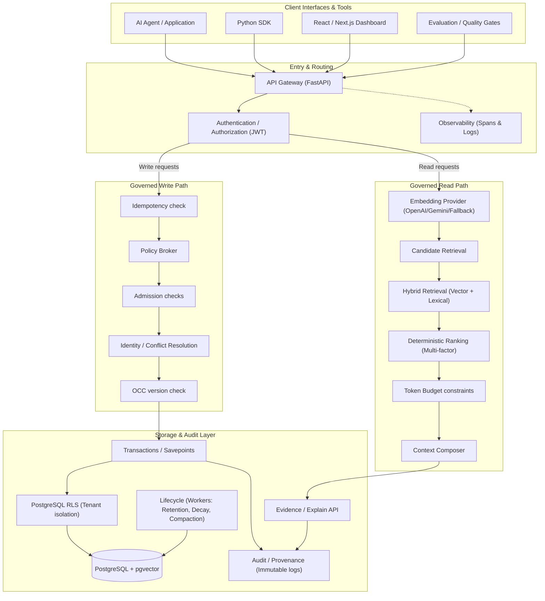

# MemoryOps AI

[]()
[]()
[]()
[]()
[]()

Governed long-term memory infrastructure for AI agents — featuring policy-controlled writes, deterministic hybrid retrieval, secure multi-tenancy, context admission controls, state lifecycle decay, and auditable proof-of-decision evidence.

*   **Current Version:** `0.4.0`
*   **Development Status:** Stable Hardened Release Candidate (Phase 3E Complete)
*   **Test Suite:** 283 tests verifying In-Memory and PostgreSQL runners (253 passing cleanly offline/in-memory)
*   **Evaluation Pass Rate:** 100% (28 golden cases verified on the benchmark runner)
*   **License:** MIT

---

## Table of Contents

1.  [Live Demo / Quick Links](#live-demo--quick-links)
2.  [What Problem Does MemoryOps AI Solve?](#what-problem-does-memoryops-ai-solve)
3.  [Why MemoryOps AI? (The Core Thesis)](#why-memoryops-ai-the-core-thesis)
4.  [Key Capabilities](#key-capabilities)
5.  [Architecture](#architecture)
6.  [Memory Lifecycle](#memory-lifecycle)
7.  [Retrieval Strategy & Fallback Mechanics](#retrieval-strategy--fallback-mechanics)
8.  [Authentication & Authorization](#authentication--authorization)
9.  [Multi-Tenancy & Database-Level RLS](#multi-tenancy--database-level-rls)
10. [Idempotency Mechanism](#idempotency-mechanism)
11. [Auditability & Observability](#auditability--observability)
12. [Tech Stack](#tech-stack)
13. [Project Structure](#project-structure)
14. [Getting Started](#getting-started)
15. [API Reference](#api-reference)
16. [Testing & Verification](#testing--verification)
17. [Production Verification](#production-verification)
18. [Current Limitations](#current-limitations)
19. [Roadmap](#roadmap)
20. [Design Decisions (ADRs)](#design-decisions-adrs)
21. [License](#license)

---

## Live Demo / Quick Links

### Local Development Links
*   **Frontend (Dashboard):** [http://localhost:3000](http://localhost:3000)
*   **Backend API:** [http://127.0.0.1:8000](http://127.0.0.1:8000)
*   **Swagger / Interactive API Docs:** [http://127.0.0.1:8000/docs](http://127.0.0.1:8000/docs)
*   **OpenAPI Specification JSON:** [http://127.0.0.1:8000/openapi.json](http://127.0.0.1:8000/openapi.json)

### Deployed Production Links
*   **Production API Base:** `https://memoryops-ai-production-47ac.up.railway.app`
*   **Production Swagger / API Docs:** [https://memoryops-ai-production-47ac.up.railway.app/docs](https://memoryops-ai-production-47ac.up.railway.app/docs)
*   **Production OpenAPI Specification JSON:** [https://memoryops-ai-production-47ac.up.railway.app/openapi.json](https://memoryops-ai-production-47ac.up.railway.app/openapi.json)
*   **Production Health Endpoint:** [https://memoryops-ai-production-47ac.up.railway.app/healthz](https://memoryops-ai-production-47ac.up.railway.app/healthz)
*   **Production Readiness Endpoint:** [https://memoryops-ai-production-47ac.up.railway.app/readyz](https://memoryops-ai-production-47ac.up.railway.app/readyz)
*   **Production Frontend (Dashboard):** `[Production frontend URL — configure after deployment]`

---

## What Problem Does MemoryOps AI Solve?

In modern LLM applications, long-term memory is typically implemented as a naive vector search cache. While this retrieves context, it fails in production settings due to several operational challenges:

*   **Memory Staleness:** Agent preferences change over time. If a user moves from Boston to Seattle, cosine similarity retrieves both facts, causing conflicting context.
*   **PII & Credential Leaks:** Extractor models are probabilistic. If an LLM extracts an API key or password, raw vector databases store and retrieve it silently.
*   **Unbounded Duplication:** Similar user actions yield duplicate memory records representing the same semantic entity, inflating prompt token costs.
*   **Forgetting & Deletion Invariants:** Soft-deletions must execute cleanly across vector indices. Metadata filters are bypassable and prone to leakages.
*   **Multi-Tenant Isolation:** Relational databases must enforce row-level safety rules on vector lookups without performance penalties.
*   **Prompt Bloat:** Retrieved memories must not blindly flood the model context. Admissions controllers should filter and redact based on budgets.
*   **Auditable Decisions:** Operators need a trace verifying *why* a memory was stored, retrieved, or deleted.

---

## Why MemoryOps AI? (The Core Thesis)

### Memory is System State, Not Merely Embeddings

Embeddings are merely searchable indices. Memory is state. Because it is system state, it must adhere to traditional database rigor:

*   **Governance:** Writes must pass deterministic filters (regex sanitization, token checks) before hitting storage.
*   **Deterministic Decisions:** Context ranking should not fluctuate. Identical query metrics must generate identical prompt contents.
*   **Security:** Multi-tenancy is isolated at the database engine level, not in the application layer where bugs can bypass filters.
*   **Lifecycle:** Inactive memories decay, archive, and undergo secure compaction where text contents and vectors are zeroed out.
*   **Evidence:** Every state transition is recorded in an immutable, append-only audit trail.

---

## Key Capabilities

| Capability | What It Provides | Implemented Reference |
| :--- | :--- | :--- |
| **Governed Writes** | Policy-driven filtering of candidate writes. | [broker.py](services/api/app/policy/broker.py) |
| **Hybrid Retrieval** | Combined vector search and lexical Jaccard matching. | [retrieval.py](services/api/app/services/retrieval.py) |
| **Context Admission** | Strict character-limit budgeting with oversized skipping. | [retrieval.py](services/api/app/services/retrieval.py) |
| **Multi-Tenancy** | Partitioning of records by Tenant ID and User ID. | [postgres.py](services/api/app/repositories/postgres.py) |
| **PostgreSQL RLS** | Database-enforced tenant Row-Level Security. | [008_harden_row_level_security.sql](infra/db/migrations/008_harden_row_level_security.sql) |
| **JWT Authorization** | JWT verification with tenant-scope check rules. | [auth.py](services/api/app/services/auth.py) |
| **Idempotency** | Prevents write duplications via request-key locks. | [idempotency.py](services/api/app/services/idempotency.py) |
| **OCC** | Version-column optimistic concurrency checks. | [postgres.py](services/api/app/repositories/postgres.py) |
| **Transactions** | contextvars-backed SQL savepoints and memory snapshots. | [transactions.py](services/api/app/repositories/transactions.py) |
| **Deletion Guarantees** | Soft deletion followed by vector and content compaction. | [governance.py](services/api/app/services/governance.py) |
| **Audit Trails** | Immutable, append-only mutation event logging database. | [audit.py](services/api/app/services/audit.py) |
| **Lifecycle Engine** | Background tasks for Decay, Compaction, and Retention. | [lifecycle.py](services/api/app/services/lifecycle.py) |
| **SDK** | Typed async HTTP client. | [client.py](sdk/memoryops-sdk/memoryops_sdk/client.py) |
| **Evaluation Suite** | Golden scenario runner with programmatic quality gates. | [runner.py](evals/runner.py) |
| **Observability** | Trace ID propagation across decorators and logs. | [telemetry.py](services/api/app/telemetry.py) |

---

## Architecture

The following diagram details the actual implemented services, routing gates, data paths, and storage integrations of the MemoryOps AI engine:



---

## Memory Lifecycle

Memory is treated as governed system state, routing through the following steps:

```text
User Message
    ↓
Chat API (Validation of coordinates against JWT identity)
    ↓
Identity / Authorization
    ↓
Memory Candidate Extraction (Evaluates statements starting with "remember that ")
    ↓
Policy Evaluation (Scans content for credentials and blocks high sensitivity/secrets)
    ↓
Memory Persistence (Updates active slot entries or inserts new records under transaction blocks)
    ↓
PostgreSQL (Saves to 'memories' table and logs to 'memory_audit_logs' atomically)
    ↓
Retrieval / Ranking (Retrieves scoped active candidates, calculating lexical matching & vector similarity)
    ↓
Context Composition (Formats context within a character budget limit, dropping overflow candidates)
    ↓
Chat Response
```

### Key Memory Concepts
*   **Semantic Memory:** Declarative knowledge representing facts (e.g. resident locations, technology stack preferences).
*   **Procedural Memory:** Instructions and style guides governing *how* actions should be performed (e.g. explanation style preferences).
*   **Episodic Memory:** Contextual records capturing past interactions.
*   **Candidate Memories:** Ephemeral memory structures proposed by extractors before passing validation.
*   **Policy Decisions:** Decisions made by the policy broker (`SAVE`, `UPDATE_EXISTING`, `MERGE_WITH_EXISTING`, `BLOCK`, `REDACT`) to control state mutations.
*   **Memory Persistence:** ACID-compliant database inserts and updates equipped with version control columns.
*   **Retrieval:** Tenant/User scoped search returning up to 50 active candidates.
*   **Ranking:** Multi-factor score mixing semantic similarity, keyword match overlap, raw importance, recency, extraction confidence, and reinforcement count.
*   **Audit Events:** Immutable logs tracing memory actions (`create`, `update`, `delete`, `decay`, `compact`).

---

## Retrieval Strategy & Fallback Mechanics

The system supports hybrid retrieval combining **vector search (pgvector)** and **lexical search (Jaccard token matching)**.

```text
Score = 0.35 * semantic + 0.20 * lexical + 0.15 * importance + 0.10 * recency + 0.10 * confidence + 0.10 * reinforcement
```

### Fallback/Lexical Retrieval
If embedding provider API keys (OpenAI or Google Gemini) are not configured or become unavailable, the `RetrievalCoordinator` degrades gracefully to **lexical fallback mode**:
*   The API returns `"retrieval_mode": "fallback"` and `"semantic_score": 0.0` for all candidates.
*   The Jaccard matching coefficient matches tokenized unique query terms with normalized candidate content tokens.
*   This ensures search capabilities remain online even during external API outages.

---

## Authentication & Authorization

Authentication is based on JSON Web Tokens (JWT) using the symmetric HMAC-SHA256 signature algorithm.

### Access Token Acquisition
To obtain a bearer JWT, clients authenticate against:
```http
POST /api/auth/token
Content-Type: application/json

{
  "username": "DEMO_AUTH_USERNAME",
  "password": "DEMO_AUTH_PASSWORD"
}
```
*Credentials are resolved strictly from environment variables on the backend and are never committed to source control.*

The API response returns an `access_token` containing a payload specifying coordinate scopes:
*   `tenant_id`: `"tenant_demo"`
*   `user_id`: `"user_demo"`
*   `scopes`: `["memory:read", "memory:write", "audit:read", "governance:admin"]`

### Swagger Authorization Workflow
1. Call `POST /api/auth/token` with configured demo credentials.
2. Copy the `access_token` string from the JSON response.
3. Click the green **Authorize** button at the top of the Swagger API Docs page.
4. Input the token in the text box (Swagger uses standard Bearer Authentication context).
5. Interact with protected routes securely.

---

## Multi-Tenancy & Database-Level RLS

Memory records are tightly bound to a `tenant_id` and `user_id`.

### Row-Level Security (RLS)
PostgreSQL table schemas (`memories` and `idempotency_records`) enforce database-level isolation:
*   Active database connection sessions execute in a context that assigns `app.current_tenant_id` and `app.current_user_id`.
*   PostgreSQL Row-Level Security filters ensure database queries cannot return or modify records belonging to other tenants or users, preventing application bugs from leaking cross-tenant data.
*   The application API route logic double-checks that the request coordinates match the JWT identity details (`HTTP 403 Forbidden` is raised on mismatches).

---

## Idempotency Mechanism

To prevent duplicate requests (such as double-submitted writes from chat clients), MemoryOps AI features an idempotency middleware layer:

*   **Header:** Clients supply a unique key in the `X-Idempotency-Key` header.
*   **Database Record:** The `idempotency_records` table stores the request key, tenant, user, response status, and response body.
*   **Behavior:**
    *   If a request with an existing `(key, tenant_id, user_id)` is received, the API bypasses the execution pipeline and immediately returns the cached status code and response body.
    *   If a request is currently processing, concurrent requests block on lock entries.
    *   Idempotency records are scoped using the same RLS policies to maintain multi-tenant security boundaries.

---

## Auditability & Observability

Audit logs and telemetry trace execution flows end-to-end:

*   **Trace ID Propagation:** Client requests can supply an `X-Trace-ID` header. If absent, a unique UUID (`trace-{uuid}`) is generated. This trace identifier propagates through logs, database audit logs, and API responses.
*   **Memory Audit Logs:** Inserted atomically within write/update database transactions into `memory_audit_logs` (tracking memory ID, event action, reason, metadata, and trace ID).
*   **Retrieval Telemetry:** Emit events recording latency, candidate match counts, final scores, and active retrieval mode.

---

## Tech Stack

*   **Backend Framework:** Python 3.11+, FastAPI (Pydantic settings/schemas, async context managers)
*   **Database:** PostgreSQL 15+ equipped with the `pgvector` extension
*   **Database Client:** `asyncpg` (Asynchronous connection pooling and query executions)
*   **Frontend Dashboard:** Next.js (React 19, TypeScript, PostCSS/Tailwind CSS styling)
*   **Containerization:** Docker (with `docker-compose` definition files)

---

## Project Structure

```text
memoryops-ai/
├── Dockerfile                   # Multi-stage container build
├── docker-compose.yml           # Local PostgreSQL and database setup
├── requirements.txt             # Application dependency manifest
├── requirements-dev.txt         # Dev-specific dependencies (pytest, black, mypy)
├── services/
│   └── api/
│       └── app/
│           ├── main.py          # FastAPI application startup & routing
│           ├── config.py        # Settings configuration class
│           ├── runtime.py       # Dependency injection container
│           ├── domain/          # Shared domain entities & enums
│           ├── policy/          # Writes filter logic (Broker, regex filters)
│           ├── repositories/    # Database repository adapters (PostgreSQL, InMemory)
│           ├── routes/          # REST API endpoints (chat, governance, auth)
│           └── services/        # Business pipeline logic (retrieval, write, lifecycle)
├── sdk/                         # Client Python SDK (memoryops-sdk)
├── frontend/                    # Next.js Dashboard UI web application
├── evals/                       # Quality evaluation suite (golden cases, runner)
└── tests/                       # Complete verification test suite
```

---

## Getting Started

### Prerequisites
*   Python 3.11+
*   Docker & Docker Compose (required for PostgreSQL tests and local runs)

### Environment Variables
Create a local `.env` file by copying the template:
```bash
cp .env.example .env
```

#### Running Offline (InMemory Default)
To test locally without external database infrastructure or API keys:
```env
DATABASE_TYPE=memory
EMBEDDING_PROVIDER=fallback
```

#### Running with Google Gemini
To test semantic vector matching, update your `.env` with a Gemini API key:
```env
EMBEDDING_PROVIDER=gemini
GEMINI_API_KEY=your_google_gemini_api_key
```

### Running the Backend
1.  Initialize a virtual environment and install dependencies:
    ```bash
    python -m venv .venv
    source .venv/bin/activate  # Windows: .venv\Scripts\activate
    pip install -r requirements.txt -r requirements-dev.txt
    ```
2.  Start local database container:
    ```bash
    docker compose up -d
    ```
3.  Execute migrations:
    ```bash
    python infra/db/run_migrations.py
    ```
4.  Run the Uvicorn application:
    ```bash
    uvicorn services.api.app.main:app --host 127.0.0.1 --port 8000 --reload
    ```

### Running the Frontend
1. Navigate to the frontend directory:
   ```bash
   cd frontend
   npm install
   npm run dev
   ```
2. Open [http://localhost:3000](http://localhost:3000) to view the dashboard interface.

---

## API Reference

### Core Endpoints

#### `POST /api/auth/token`
*   **Description:** Authenticates user credentials and issues a JWT token.
*   **Auth Required:** No
*   **Request Body:** `username`, `password` (loaded from env variables).
*   **Response:** `access_token`, `token_type` (bearer), `expires_in` (seconds).

#### `POST /api/chat`
*   **Description:** Primary interface processing chat loops, context retrievals, and memory updates.
*   **Auth Required:** Yes (`memory:write` scope)
*   **Headers:** Optional `X-Idempotency-Key` and `X-Trace-ID`
*   **Request Body:** `tenant_id`, `user_id`, `message` (triggers extraction if starts with "remember that "), `temporary_chat` (boolean, bypasses write persistence if true), `conversation_id`.
*   **Response:** `assistant_message`, `used_memories` (list of matching memories with breakdown), `candidate_memories` (newly extracted and processed memories), `audit_event_ids`, `temporary_chat`, `retrieval_mode`, `trace_id`.

#### `GET /healthz`
*   **Description:** General service status, uptime indicator, and project version.
*   **Auth Required:** No

#### `GET /readyz`
*   **Description:** Validates service readiness (verifies DB status and Gemini/embedding credentials).
*   **Auth Required:** No

### Governance Endpoints (Require Auth Coordinate checks)

*   `GET /api/memories` — Lists memory records. Requires scope `memory:read`.
*   `GET /api/memories/{memory_id}` — Gets a single memory record. Requires scope `memory:read`.
*   `PATCH /api/memories/{memory_id}` — Mutates specific columns (importance, confidence, status, content). Requires scope `memory:write`. Supports `X-Idempotency-Key`.
*   `DELETE /api/memories/{memory_id}` — Deletes a record physically from index and compacts content. Requires scope `governance:admin`. Supports `X-Idempotency-Key`.
*   `GET /api/memories/{memory_id}/provenance` — Retrieves memory source kind and conversational origin excerpt. Requires scope `memory:read`.
*   `GET /api/memories/{memory_id}/evidence` — Packages record details and full transaction audit log trail. Requires scope `audit:read`.
*   `GET /api/memories/{memory_id}/audit` — Returns list of audit events matching memory ID. Requires scope `audit:read`.
*   `GET /api/audit` — Queries audit event lists. Requires scope `audit:read`.
*   `GET /api/metrics` — Gets metrics summaries (active memory distributions, error rate counts). Requires scope `governance:admin`.

---

## Testing & Verification

MemoryOps AI incorporates a robust verification suite containing **283 tests** (verifying connection pools, transactional rollbacks, token scopes, RLS policies, Jaccard scores, and background workers).

### Running Tests

#### Offline (InMemory Mode)
```bash
cmd /c "set DATABASE_TYPE=memory && pytest -q"
```
*(All 253 in-memory and unit tests pass cleanly in offline mode).*

#### Database Integration (PostgreSQL Mode)
```bash
cmd /c "set DATABASE_TYPE=postgres && pytest -q"
```
*(Requires a running PostgreSQL instance on port 5433).*

---

## Production Verification

The deployed system (`https://memoryops-ai-production-47ac.up.railway.app`) has been verified to ensure stability under load:
1.  **Authentication is Functional:** Validates credentials and returns JWT bearer tokens.
2.  **API Chat End-to-End:** Processes read/write queries successfully.
3.  **Memory Extraction & Policy Control:** Content matching credentials (like API keys or passwords) is successfully blocked; valid statements are written to database.
4.  **Database Persistence:** Atomically records memories, audit entries, and version counters in PostgreSQL.
5.  **Idempotency & Locks:** Confirmed that duplicate requests receive cached responses.
6.  **Deterministic Retrieval Ranking:** Queries retrieve exact memory matches and assign them to Rank #1.
7.  **RLS Enforcement:** Rejects cross-tenant access attempts with explicit coordinate authorization checks.

---

## Current Limitations

For production deployments, note the following limitations:

*   **Mocked LLM Response Text:** The `/api/chat` endpoint is a control-plane runtime. The actual chatbot conversational text response is mocked, focusing instead on returning structured context arrays (`used_memories` and `candidate_memories`).
*   **Offline Fallback Mode:** In the default production environment where embedding keys are not provided, vector cosine distance results default to fallback mode (`semantic_score` of 0). The system falls back on lexical term-matching.
*   **Optimistic Concurrency Control (OCC):** Concurrent update requests on high-contention memory records can cause transaction rollbacks. Mismatches must be queued or retried at the client/SDK layer.
*   **Lexical Matching Scope:** Lexical keyword Jaccard scoring splits tokens on simple string tokenization, lacking advanced English stemming or stopword filtration libraries.

---

## Roadmap

*   **Phase 1 (Completed):** Governed write path, Policy Broker validation, and transaction blocks.
*   **Phase 2 (Completed):** Retrieval spine, Jaccard lexical logic, and deterministic ranking formulas.
*   **Phase 3 (Completed):** PostgreSQL + pgvector persistence, migrations, and Row-Level Security.
*   **Phase 4 (Completed):** Background workers (Retention, Decay, Reflection, Compaction).
*   **Phase 5 (Completed):** Model-agnostic embedding provider factory (OpenAI, Gemini, Fallback).
*   **Phase 6 (Future):** Tamper-evident audit trail hashing.

---

## Design Decisions (ADRs)

Key architectural choices are documented under [infra/adr/](infra/adr/):

*   [ADR-001: Storage Selection](infra/adr/ADR-001-storage.md) — Chooses PostgreSQL with `pgvector` as the system of record.
*   [ADR-002: Hybrid Retrieval and Deterministic Ranking](infra/adr/ADR-002-retrieval.md) — Blends vector search with token Jaccard matching.
*   [ADR-003: Policy Broker before Storage](infra/adr/ADR-003-policy-broker.md) — Controls write mutations with upfront policies.
*   [ADR-004: Context Propagation and Observability](infra/adr/ADR-004-observability.md) — Defines trace ID decorators and observability hooks.
*   [ADR-005: Deletion Guarantee](infra/adr/ADR-005-deletion-guarantee.md) — Configures hard compaction steps following logical deletions.
*   [ADR-006: Memory Identity and Write-Path Mutation](infra/adr/ADR-006-memory-identity-and-write-path-mutation.md) — Solves conflicts using unique identity slots.
*   [ADR-007: Embedding Provider and Model](infra/adr/ADR-007-embedding-provider-and-model.md) — Selects Gemini and OpenAI embedding details.
*   [ADR-008: Provider-Agnostic Embedding Architecture](infra/adr/ADR-008-provider-agnostic-embedding-architecture.md) — Introduces the runtime embedding factory adapter.

---

## License

MemoryOps AI is open-source software licensed under the [MIT License](LICENSE).
