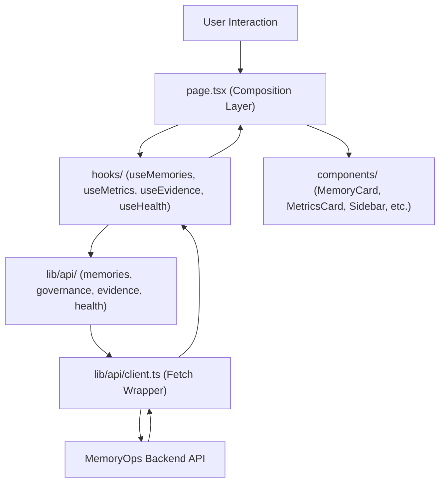

# Frontend Architecture Documentation

This document outlines the modular Next.js production architecture of the MemoryOps AI Control Plane.

---

## 1. Folder Structure

We refactored the concentrated `page.tsx` into single-responsibility, type-safe directories under `frontend/src/`:

```text
frontend/src/
├── app/
│   ├── layout.tsx       # Standard Next.js layout configuration
│   ├── page.tsx         # Composition layer coordinating layout, hooks, and views
│   └── globals.css      # Shared glassmorphic CSS rules
│
├── components/          # Reusable presentation and view layout components
│   ├── common/
│   │   ├── EmptyState.tsx
│   │   ├── ErrorState.tsx
│   │   └── LoadingState.tsx
│   ├── layout/
│   │   ├── Navbar.tsx
│   │   └── Sidebar.tsx
│   ├── memory/
│   │   ├── EvidencePanel.tsx
│   │   ├── MemoryCard.tsx
│   │   ├── MemoryFilters.tsx
│   │   └── MemoryList.tsx
│   ├── governance/
│   │   └── AuditTimeline.tsx
│   └── dashboard/
│       └── MetricsCard.tsx
│
├── hooks/               # State managers and async lifecycle logic hooks
│   ├── useEvidence.ts   # Fetches evidence provenance logs
│   ├── useHealth.ts     # Healthcheck status checks
│   ├── useMemories.ts   # Registry CRUD operations and filtering
│   └── useMetrics.ts    # Statistics and audit trail timelines
│
├── lib/                 # Core utilities, API clients, and types
│   ├── api/
│   │   ├── client.ts    # Fetch client base request wrapper
│   │   ├── evidence.ts  # Provenance query paths
│   │   ├── memories.ts  # CRUD memory endpoints
│   │   ├── governance.ts# Audit trail and metrics endpoints
│   │   └── health.ts    # Uptime status paths
│   └── types/
│       ├── api.ts       # Shared API response interfaces
│       ├── governance.ts# Audit log and metrics shapes
│       └── memory.ts    # MemoryRecord structure definitions
```

---

## 2. Layer Responsibilities & Contracts

### A. Composition Layer (`src/app/page.tsx`)
Constitutes the main shell. It is a Client Component that:
1.  Holds the root scoped states: `tenantId`, `userId`, `activeTab` ("registry" | "audit" | "metrics").
2.  Mounts custom React hooks to initialize underlying lists and trackers.
3.  Assembles layout components (`Sidebar`, `Navbar`), chat loops, views, and modal panels.

### B. Custom Hooks (`src/hooks/`)
Handles React state and asynchronous effect triggers:
*   `useHealth`: Validates connections, records system version, and returns current uptime status state.
*   `useMemories`: Manages filtered lists, status switches, deletions, and updates.
*   `useMetrics`: Fetches aggregate counters and overall audit timeline logs.
*   `useEvidence`: Manages detailed provenance logs, saving initial policy reason/decisions.

### C. Components (`src/components/`)
Strictly presentational. They do not initiate direct HTTP calls. Instead, they accept data models via `props` and fire operations using callbacks:
*   `MemoryFilters`: Coordinates search input and status/type selector boxes.
*   `MemoryList` & `MemoryCard`: Displays lists and items with dynamic badges and state-handling triggers.
*   `Sidebar`: Configuration controls for scoping IDs, quick prompt templates, and health checklists.

### D. API & Typings Layer (`src/lib/`)
*   `src/lib/api/client.ts` centralizes response checks, decoding JSON payloads, and raising explicit error logs.
*   `src/lib/types/` defines type schemas ensuring 100% type safety and eliminating `any` types.

---

## 3. Data & State Flow



1.  **Mount:** The page calls `useHealth`, `useMemories`, and `useMetrics` hooks.
2.  **Dashboard Load:** An effect in `page.tsx` fires `loadDashboardData()`, triggering parallel data fetches.
3.  **Chat Write:** Submitting a prompt sends a write request. The response returns explainability metadata which is appended to `chatHistory`.
4.  **Refresh Sync:** Successful mutations trigger a reload of memories and metrics, synchronizing the control panel UI.

---

## 4. How to Add a New Feature

To add a new feature (for example: **Feedback Loops** for reinforcing memories):

1.  **Define Types:** Create relevant type schemas in a new file under `src/lib/types/feedback.ts`:
    ```typescript
    export interface MemoryFeedback {
      memory_id: string;
      thumbs_up: boolean;
      comment?: string;
    }
    ```
2.  **Declare API Method:** Add a request handler inside `src/lib/api/memories.ts`:
    ```typescript
    async submitFeedback(feedback: MemoryFeedback): Promise<void> {
      return request<void>(`/api/memories/${feedback.memory_id}/feedback`, {
        method: "POST",
        headers: { "Content-Type": "application/json" },
        body: JSON.stringify(feedback),
      });
    }
    ```
3.  **Implement custom Hook:** Expose state and handlers in `src/hooks/useFeedback.ts`:
    ```typescript
    import { useState, useCallback } from "react";
    import { memoriesApi } from "../lib/api/memories";
    import { MemoryFeedback } from "../lib/types/feedback";

    export function useFeedback() {
      const [submitting, setSubmitting] = useState(false);
      const submitFeedback = useCallback(async (feedback: MemoryFeedback) => {
        setSubmitting(true);
        try {
          await memoriesApi.submitFeedback(feedback);
        } finally {
          setSubmitting(false);
        }
      }, []);
      return { submitFeedback, submitting };
    }
    ```
4.  **Create View Component:** Build presentation cards in `src/components/memory/FeedbackButton.tsx`.
5.  **Compose:** Import the hook and component in `src/app/page.tsx`, mount the components, and bind event handlers.
